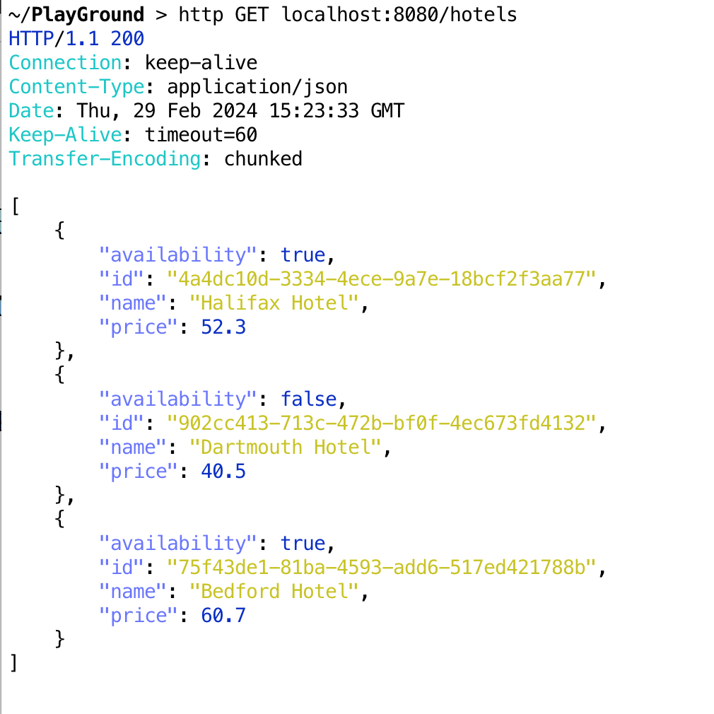
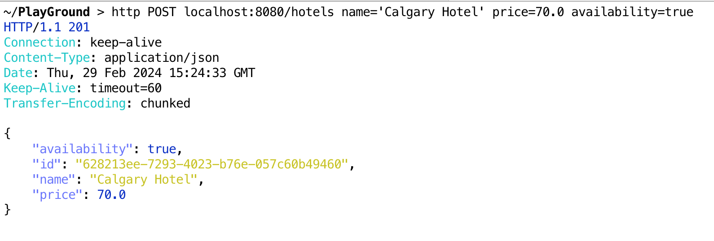
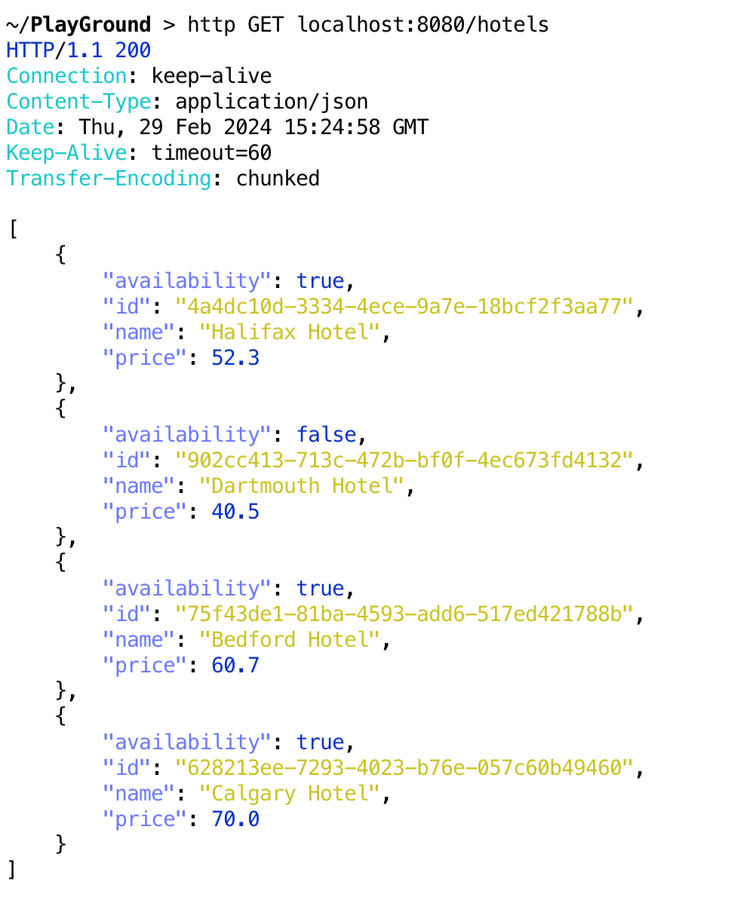

# Hotel Reservation API

This Hotel Reservation API is a spring boot application that provides a REST API that provide two endpoints
1. GET /hotels : Get list of hotels available in the database
2. POST /hotels : Adds a new hotel into the database
`{ name: <name of hotel> ..... }`

## Get Started
Ensure you have Java and maven installed on your system to manage packages and run the developement server.

## How to access the REST API
To get the list of hotels in the database you use the GET request `http://localhost:8080/hotels`, 
you get back a list of the saved hotels. e.g 

To add a new hotel to the database you use the POST request `http://localhost:8080/hotels`,
with the details of the hotel like name, price and availability.

If you request the list of hotels again you see the newly created hotel added to the list hotels

